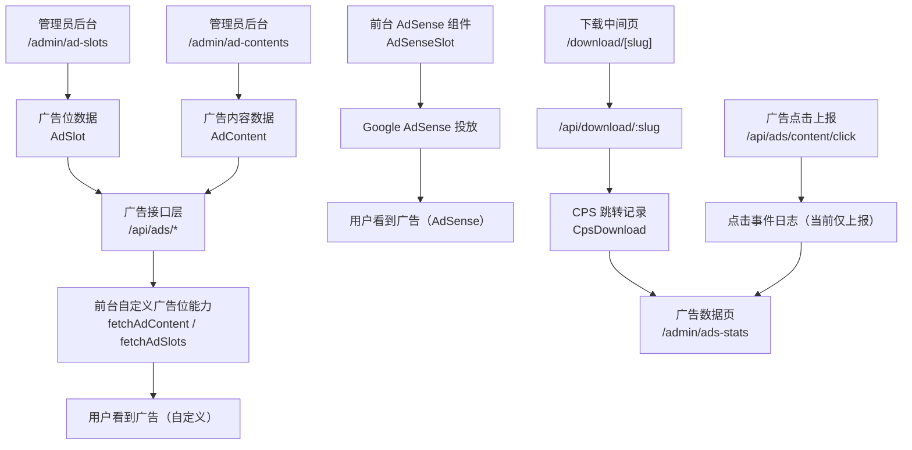

# 广告管理后台单页流程图版

> 目标：一页看懂“后台配置 -> 前台展示 -> 数据统计 -> 收益归因”
> 适用项目：`E:\Project\Triangle`

## 1. 全链路总览

## 2. 页面与接口对应

| 后台页面 | 主要动作 | 核心接口 | 数据模型 |
|---|---|---|---|
| `/admin/ad-slots` | 新建/编辑/删除广告位 | `/api/ads/admin/slots`、`/api/ads`、`/api/ads/:id` | `AdSlot` |
| `/admin/ad-contents` | 新建/编辑/删除广告内容 | `/api/ads/admin/contents`、`/api/ads/admin/contents/:id` | `AdContent` |
| `/admin/ads-stats` | 看总览与趋势 | `/api/ads/admin/stats` | `AdSlot` + `AdContent` + `DownloadLog` + `CpsDownload` |

## 3. 你看到“看不懂”的根因

1. 当前前台主展示以 `AdSenseSlot` 为主（Google 广告）。
2. 后台 `AdSlot/AdContent` 是自定义广告能力，已可管理，但前台默认位点未全量接线。
3. 所以会出现“后台能配素材，前台不一定立刻变化”。

## 4. 数据口径（避免误判）

1. `广告数据`页里的“近7天趋势”主要来自 `CpsDownload`（下载跳转点击）。
2. 它不是纯 `AdContent` 点击数，不要和 AdSense 控制台点击直接一一对照。
3. 收益口径优先看 AdSense 控制台，后台趋势用于内部运营判断。

## 5. 最短操作闭环

1. 先在 `广告位管理` 建标准广告位（名称、尺寸、位置统一）。
2. 再在 `广告内容管理` 录入素材（目标链接、优先级、启用状态）。
3. 用 `广告数据` 看趋势变化。
4. 以 AdSense 后台收益作为最终变现结果。

## 6. 快速排障

1. 列表报 `400`：检查 `pageSize` 是否超过 `100`。
2. 新增后前台没变化：先确认该位置是否实际走 AdSense。
3. 下载页报 JSON 错误：确认请求路径是 `/api/download/:slug`，不是页面路由。

